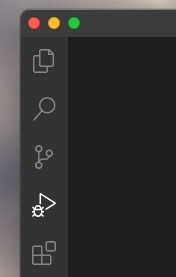

# HTTP demo

In this demonstration of the proof debugger,
you will clone the [FreeRTOS HTTP](https://github.com/FreeRTOS/coreHTTP)
code repository,
break the CBMC proofs in that repository, and examine the counterexample
traces produced by CBMC from within Visual Studio Code using the proof debugger.

## Install the tools

Install the tools needed for this demonstration with
* [CBMC](https://github.com/diffblue/cbmc):
Follow these [installation instructions](https://model-checking.github.io/cbmc-training/installation.html) to install CBMC and related tools.
* [Visual Studio Code](https://code.visualstudio.com):
Follow these [installation instructions](https://code.visualstudio.com/Download)
to install Visual Studio Code.
* [Proof debugger](https://gitlab.aws.dev/cbmc/proof-debugger):
Follow these [installation instructions](../installation.md)
to install the proof debugger into Visual Studio Code.

## Download the code

Clone the FreeRTOS HTTP code repository with

```
git clone https://github.com/FreeRTOS/coreHTTP
cd coreHTTP
git submodule update --init --checkout --recursive
```

## Break the proofs

Break the proofs in FreeRTOS HTTP code repository with

```
sed -i '' 's/.*__CPROVER_assume(.*);.*//' test/cbmc/sources/http_cbmc_state.c
```

This `sed` command deletes some of the proof assumptions that the proofs
depend on, guaranteeing that the proofs will now fail.
The proof harnesses in the repository
(similar to unit tests) model the environment of the
functions under
test by allocating objects on the heap that satisfy various proof assumptions.
The functions allocating these objects are defined in the source file
[test/cbmc/sources/http_cbmc_state.c](https://github.com/FreeRTOS/coreHTTP/blob/main/test/cbmc/sources/http_cbmc_state.c).
The `sed` command comments out most of the proof assumptions in this source
file.

## Run the proofs

The proofs are contained in the directory [test/cbmc/proofs](https://github.com/FreeRTOS/coreHTTP/tree/main/test/cbmc/proofs).  Change to this directory:

```
cd test/cbmc/proofs
```

At this point, you can either run all the proofs or run just one.
Most of the proofs will complete in a few minutes, but a few can take
as long as a half hour.
For this demonstration, we will run just one.
```
cd findHeaderFieldParserCallback
make
```
This proof finishes in about 30 seconds on an Apple M1 MacBook Pro.
If you want to run all of the proofs, however, go back to the `proofs`
directory and run the python script `run-cbmc-proofs.py`.

## View the results

At this point, you can view the proof results in a web browser with

```
open report/html/index.html
```

You can see that quite a bit is broken, and for each finding in the Errors
section you can click on the associated "trace" to view a counterexample
trace produced by CBMC demonstrating how the issue found can arise.
These traces are what we want to debug
within Visual Studio Code with the proof debugger.

## The JSON summaries

In this demonstration, you will view the proof results in Visual Studio
Code.  To do this, you will have to locate for Visual Studio Code a
`json` directory containing JSON summaries of CBMC findings.

Let's examine this `report` directory more carefully.
This directory was created by a tool called
[cbmc-viewer](https://github.com/model-checking/cbmc-viewer)
that goes over the output of CBMC and summarizes the results in
the form of an HTML report under `report/html` and in the form of
a collection JSON files under `report/json`.  We've already looked
at the HTML.  Let's look at the JSON:

```
ls report/json
```
```
viewer-coverage.json    viewer-reachable.json   viewer-symbol.json
viewer-loop.json        viewer-result.json      viewer-trace.json
viewer-property.json    viewer-source.json
```

Each file is a summary of CBMC results.  The first file
`viewer-coverage.json` described the code coverage achieved by CBMC.
The last file `viewer-trace.json` describes each of the counterexample
error traces produced by CBMC to demonstrate the issues found by CBMC.
The HTML report we just looked at is produced by rendering these JSON
summaries as HTML.
The proof debugger works by rendering these same JSON summaries within
Visual Studio Code.  To use the proof debugger, you will
have to locate this `json` directory for Visual Studio Code.

## Start Code

Now let's start Visual Studio Code in the root of the FreeRTOS HTTP source
tree:

```
cd ../../../..
code .
```

Go ahead and click "Yes, I trust the authors" of the source code in this
folder.


## Configure the debugger

To bring up the Debug and Run view, select the Debug and Run icon in
the Activity Bar on the left side of Code.

<center></center>

If debugging is not yet configured (no launch.json has been created),
Code shows the Debug and Run start view.

<center></center>

Select "create a launch.json file" and select "Proof debugger" as the
debugger.

<center></center>


## Locate the proof results

## Start the debugger